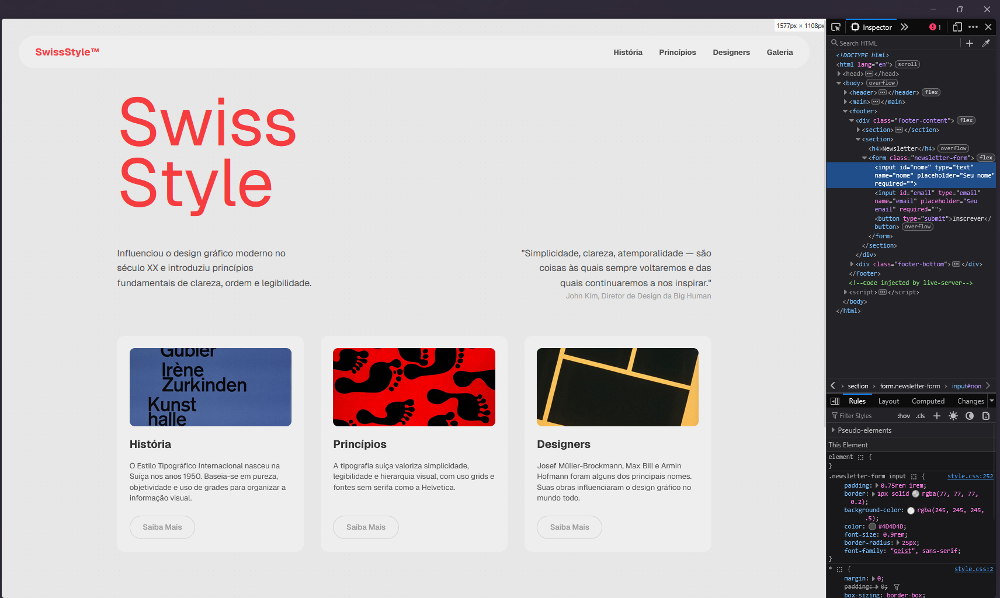
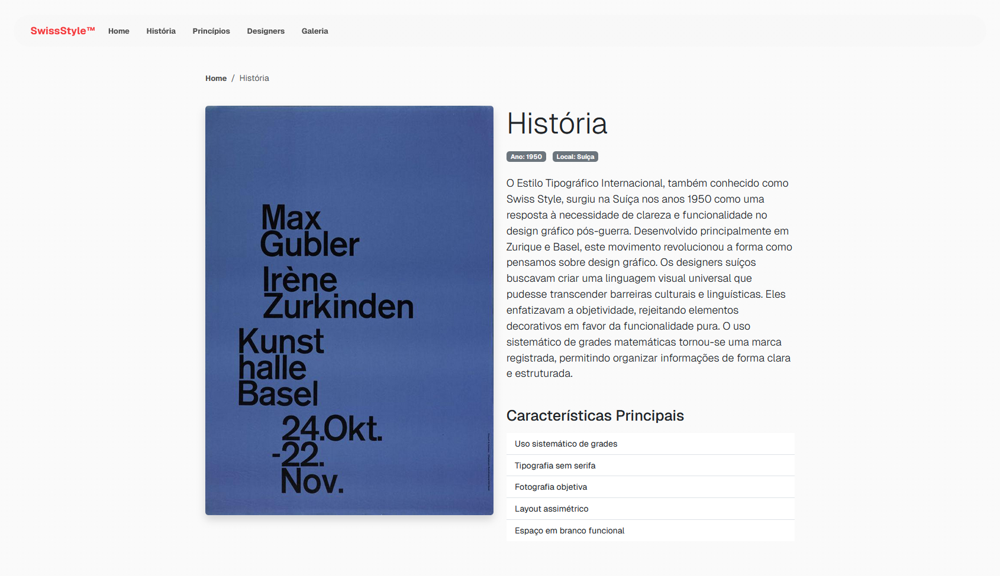

[](https://classroom.github.com/online_ide?assignment_repo_id=20906875&assignment_repo_type=AssignmentRepo)
# Trabalho Prático 05 - Semanas 7 e 8

**Páginas de detalhes dinâmicas**

Nessa etapa, vamos evoluir o trabalho anterior, acrescentando a página de detalhes, conforme o  projeto escolhido. Imagine que a página principal (home-page) mostre um visão dos vários itens que existem no seu site. Ao clicar em um item, você é direcionado pra a página de detalhes. A página de detalhe vai mostrar todas as informações sobre o item do seu projeto. seja esse item uma notícia, filme, receita, lugar turístico ou evento.

Leia o enunciado completo no Canvas. 

**IMPORTANTE:** Assim como informado anteriormente, capriche na etapa pois você vai precisar dessa parte para as próximas semanas. 

**IMPORTANTE:** Você deve trabalhar e alterar apenas arquivos dentro da pasta **`public`,** mantendo os arquivos **`index.html`**, **`styles.css`** e **`app.js`** com estes nomes, conforme enunciado. Deixe todos os demais arquivos e pastas desse repositório inalterados. **PRESTE MUITA ATENÇÃO NISSO.**

## Informações Gerais

- Nome: Gustavo Henrique Fernandes Santana
- Matricula: 906187
- Proposta de projeto escolhida: Tipografia Suíça
- Breve descrição sobre seu projeto: Este projeto tem como objetivo desenvolver uma aplicação web que apresente a Tipografia Suíça, também conhecida como Estilo Tipográfico Internacional. A homepage terá um design inspirado nos próprios princípios do estilo — clareza, simplicidade, uso de grids e tipografia sem serifa. O conteúdo será dividido em seções que exploram sua história, os designers mais influentes, os princípios fundamentais e uma galeria de obras icônicas.

## Print da Home-Page



## Print da página de detalhes do item



## Cole aqui abaixo a estrutura JSON utilizada no app.js

```javascript
const itensSwissStyle = [
    {
        id: 1,
        titulo: "História",
        categoria: "historia",
        resumo: "O Estilo Tipográfico Internacional nasceu na Suíça nos anos 1950. Baseia-se em pureza, objetividade e uso de grades para organizar a informação visual.",
        descricaoCompleta: "O Estilo Tipográfico Internacional, também conhecido como Swiss Style, surgiu na Suíça nos anos 1950 como uma resposta à necessidade de clareza e funcionalidade no design gráfico pós-guerra. Desenvolvido principalmente em Zurique e Basel, este movimento revolucionou a forma como pensamos sobre design gráfico. Os designers suíços buscavam criar uma linguagem visual universal que pudesse transcender barreiras culturais e linguísticas. Eles enfatizavam a objetividade, rejeitando elementos decorativos em favor da funcionalidade pura. O uso sistemático de grades matemáticas tornou-se uma marca registrada, permitindo organizar informações de forma clara e estruturada.",
        imagem: "https://upload.wikimedia.org/wikipedia/commons/c/cd/Kunsthalle_Basel_Gubler_Zurkinden_1959.jpg",
        ano: "1950",
        local: "Suíça",
        caracteristicas: [
            "Uso sistemático de grades",
            "Tipografia sem serifa",
            "Fotografia objetiva",
            "Layout assimétrico",
            "Espaço em branco funcional"
        ]
    },
    {
        id: 2,
        titulo: "Princípios",
        categoria: "principios",
        resumo: "A tipografia suíça valoriza simplicidade, legibilidade e hierarquia visual, com uso grids e fontes sem serifa como a Helvetica.",
        descricaoCompleta: "Os princípios fundamentais do Swiss Style são baseados na busca pela perfeição formal e comunicação eficiente. A simplicidade não significa pobreza visual, mas sim a eliminação de elementos desnecessários. A legibilidade é priorizada através do uso cuidadoso de hierarquia tipográfica e contraste visual. As grades geométricas fornecem uma estrutura invisível que organiza todos os elementos da composição. A Helvetica, desenvolvida em 1957, tornou-se o símbolo deste movimento por sua neutralidade e legibilidade. O espaço negativo é tratado com a mesma importância que os elementos positivos, criando um equilíbrio harmonioso. A fotografia é utilizada de forma objetiva, sem manipulação artística, servindo como documento visual da realidade.",
        imagem: "https://upload.wikimedia.org/wikipedia/commons/thumb/7/75/Geisser_Plakat_Mohrenball_1969.jpg/800px-Geisser_Plakat_Mohrenball_1969.jpg",
        ano: "1950-1960",
        local: "Internacional",
        caracteristicas: [
            "Simplicidade radical",
            "Hierarquia visual clara",
            "Alinhamento matemático",
            "Contraste controlado",
            "Neutralidade tipográfica"
        ]
    },
    {
        id: 3,
        titulo: "Designers",
        categoria: "designers",
        resumo: "Josef Müller-Brockmann, Max Bill e Armin Hofmann foram alguns dos principais nomes. Suas obras influenciaram o design gráfico no mundo todo.",
        descricaoCompleta: "Os pioneiros do Swiss Style estabeleceram padrões que ainda influenciam o design contemporâneo. Josef Müller-Brockmann é considerado o mestre das grades tipográficas, tendo desenvolvido sistemas complexos para organizar informação visual. Seus pôsteres para concertos da Tonhalle de Zurique são ícones do movimento. Max Bill, arquiteto, pintor e designer, trouxe princípios matemáticos da Bauhaus para o design suíço, criando obras de precisão geométrica. Armin Hofmann, professor na Escola de Design de Basel, influenciou gerações de designers com sua abordagem educacional rigorosa. Emil Ruder revolucionou a tipografia com suas pesquisas sobre legibilidade e ritmo visual. Esses designers não apenas criaram obras notáveis, mas também documentaram suas metodologias através de livros e ensaios que se tornaram fundamentais para a educação em design.",
        imagem: "https://upload.wikimedia.org/wikipedia/commons/8/87/1959_-_Gewerbemuseum_Basel_-_Alte_und_neue_Formen_in_Japan.jpg",
        ano: "1950-presente",
        local: "Suíça, Alemanha",
        caracteristicas: [
            "Josef Müller-Brockmann",
            "Max Bill",
            "Armin Hofmann",
            "Emil Ruder",
            "Adrian Frutiger"
        ]
    }
];
```